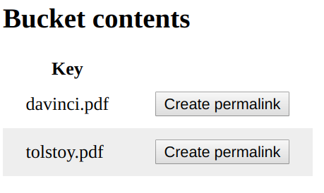
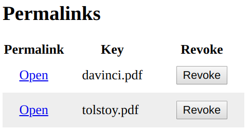
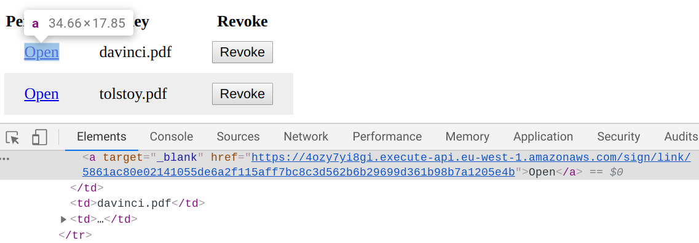
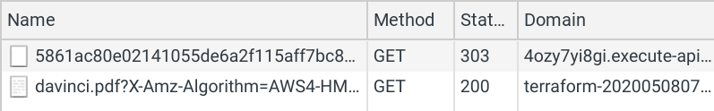
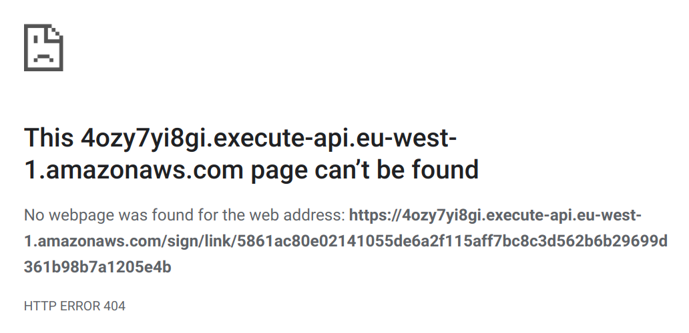

# Demo project to show how to use permanent links with signed URLs

## How it works

In this demo system users can generate permanent URLs for files in a bucket. These URLs contain a token that is used to identify the object and to check access.

The tokens are stored in a DynamoDB table along with the object's key. When a permalink is opened with a given token, this table is used to lookup the key and then a 303 redirect is sent back to the client with a signed URL.

This also provides a revoke functionality as deleting a row from a table prevents further use of that URL.

## How to deploy

### Prerequisites

* terraform

### Deploy

* terraform init
* terraform apply
* go to the resulting URL

### Cleanup

* terraform destroy

## How to use

The first table is the list of objects in the bucket. Use the button to generate a new permalink for any of them:



The list of permalinks is in the second table. It offers a link to open the file in a new tab and to revoke the permalink:



## Under the hood

The permalink calls to the backend and it specifies the token as part of the path scheme (```/link/<token>```):



When a permalink is used, the request goes to the backend. It retrieves the DynamoDB item that corresponds to that token, signs a ```getObject``` URL and sends back a 303 HTTP redirect:



## Revocation

This construct offers an easy way to revoke permalinks as removing the item from the DynamoDB table invalidates the token. If a permalink is revoken it will return a 404:



The books are from [Project Gutenberg](https://www.gutenberg.org/).
